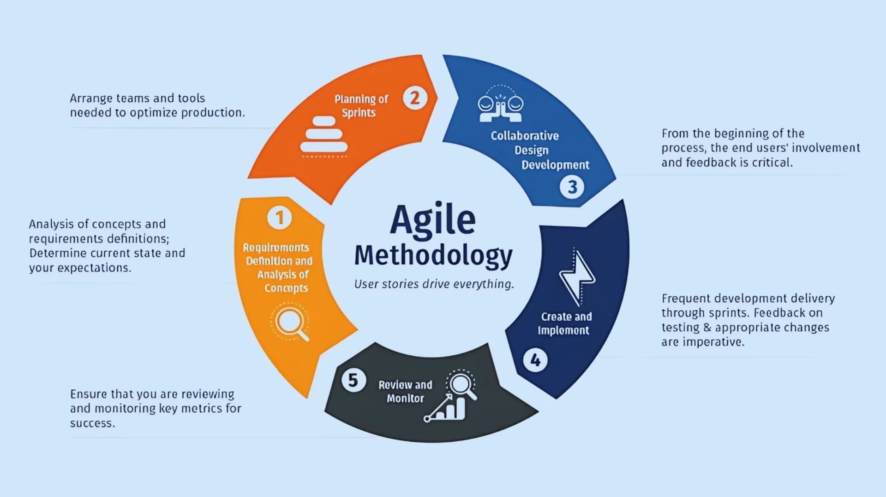
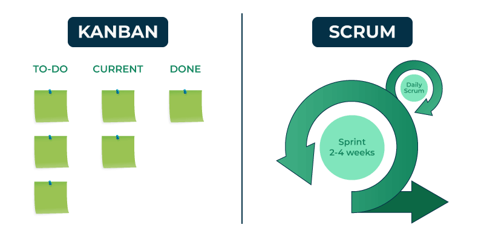

### Team Activity

- [ ] Opening the meeting
- [ ] Brief and agenda

### Agenda

- Team Leader
  - [ ] Active Listening
  - [ ] Acknowledges concerns
  - [ ] Redistribution tasks
- Team Members
  - [ ] Suggestions
  - [ ] Support
- Note Taker
  - [ ] Take Notes
    - [ ] Key points
    - [ ] Decisions

### Scenario

- Frontend

  - Common Frontend Problems Leading to Delays

    - Poor Estimation: Overly optimistic estimates are a common cause of missed deadlines, leading to developer burnout and lower-quality code.

    - Competing Demands: Frontend developers often juggle requests from multiple stakeholders, making it hard to prioritize and deliver.

    - Complex User Interactions: Designing and implementing user interfaces that are responsive, intuitive, and meet various user needs across different devices adds significant complexity.

    - Lack of Environmental Control: Frontend developers have less control over the client's environment (browsers, operating systems) compared to backend systems, which can lead to unexpected compatibility issues.

    ### Complain

    ` - The Frontend Developer complains that the backend API endpoints keep changing, forcing them to redo UI work.`

- Backend

  - Common backend problems that impact deadlines

    - Underestimating complexity: Developers may fail to account for the true difficulty of integrating multiple backend systems, services, and APIs. Complex architectural decisions, like moving from a monolith to microservices, can also have hidden costs and delays.

    - Poor database optimization: Inefficient database design and slow queries cause performance bottlenecks that get worse under heavy load. A database that works for initial testing may prove inadequate when a project scales up, requiring last-minute and time-consuming fixes.

    - Security vulnerabilities: As developers rush to meet a deadline, security can be deprioritized. This can lead to security flaws like weak authentication or SQL injection vulnerabilities, which then require urgent patches that delay the release.

    - Unforeseen issues: Unexpected events—like critical bugs, system outages, or legacy code that is difficult to maintain—can derail a timeline. These issues are often hard to estimate and can lead to significant delays if not addressed proactively.

    - Poor communication: A lack of consistent and early communication between backend developers, frontend developers, and product stakeholders can lead to misunderstandings, scope creep, and last-minute changes that cause deadlines to be missed.

    ### Complain

    `- The Backend Developer complains that the frontend team keeps requesting last-minute changes without finalizing requirements`

- ## Team Leader Solution

  - Recalculate Deadline \* 3
  - Restructure hierarchical structure
  - Distinct Leaders
  - Use Agile Methods

    - Agile project management is an iterative,
    - flexible methodology that breaks projects into small,
    - manageable cycles called sprints to deliver value incrementally and adapt to changes quickly.

    - It prioritizes customer collaboration, working solutions, individuals and interactions, and responding to change over rigid plans and extensive documentation. Key frameworks, such as Scrum and Kanban, provide structure for this philosophy, enabling teams to continuously improve through feedback and collaboration.

  - Reduce Project Scope

### What is Agile?

### Kanban VS Scrum

